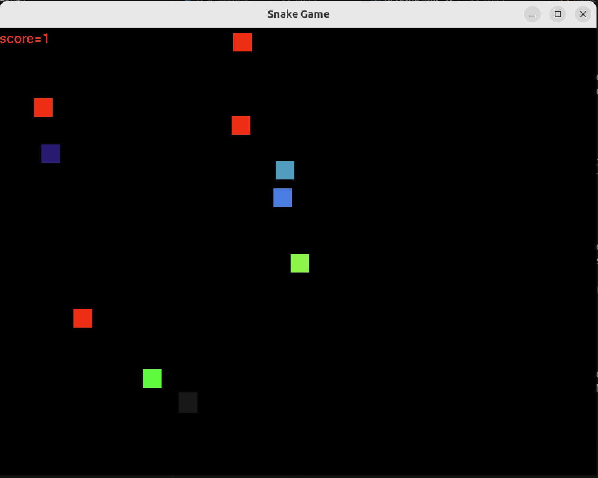

# The Snake Game Engine with Rust


This repository contain a rust implementation of the **Snake** Game. Basic code was provide by Udacity for their [Introduction to Rust](https://www.udacity.com/course/intro-to-rust--cd13678) course

## Getting Started

### Setup in Unix Environment

For this project, you'll need to have Rust installed in your machine. If you haven't installed Rust yet, you can do so with:

```bash
curl --proto '=https' --tlsv1.2 -sSf https://sh.rustup.rs | sh
```

Also, because we are dealing with C code in this project, you'll need to have a C compiler installed on your machine. You can install the `build-essential` package, which includes the GNU C Compiler (GCC) and other necessary tools. You'll need to have `GLFW` installed in your machine. GLFW is a C library that will be the foundation of our game engine. Finally `Glut` is also used for text rendering on the screen. 

All these dependencies can be installed via the makefile `setup` rule

```bash
make setup
```

### Running the Test C Game

To start with your project, clone this repository to your local machine:

```bash
git clone git@github.com:jazracherif/cd13678-intro-to-rust-starter.git
```

### Rust Projects

There are two rust project in this repo. One is the `my_game_engine` library, and provide FFI bindings to OpenCL, GLFW, and GLUT libraries written in C as well as basic game macros and several tests for the library.

Use the `starter/MakeFile` to run the basic C test code in `c_test_game/test_game.c` and verify your installation:

```bash
cd starter
```

```bash
make run-c
```

When modifying this `my_game_engine` library crate, add tests in `my_game_engine/lib.rs` and run them through the make file:

```bash
make test-rust-all
```

### Rust Game

The other rust crate is the `rust_snake_game` binary, the actual snake game that you can play!

To run the game:

```rust
cd rust_snake_game
cargo run
```

The game will spawn several snake, one of which is the user controlled snake, one is a buddy follower, and a third is an automous snake. Food will be spawned now and then, some poisonous (Red color) and other edible. Score increases as more edible food is eaten. Enjoy!





## License

[License](LICENSE.txt)
